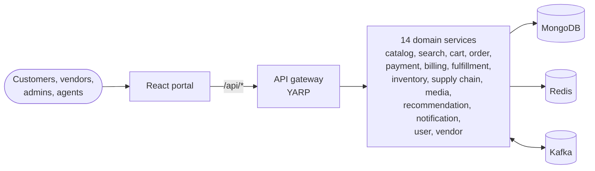

# Nakshatra

Nakshatra is an online shopping platform: a .NET 10 microservice backend behind a single API
gateway, plus a React + TypeScript portal for customers, vendors, admins and fulfillment agents.

🌐 **Live portal: https://charles2ke.github.io/Nakshatra/** — the React portal published to
GitHub Pages by [`.github/workflows/pages.yml`](.github/workflows/pages.yml). It is the frontend
only; set the `VITE_API_BASE_URL` repository variable to a reachable gateway for live data.

📐 **[Architecture & system design](docs/architecture.md)** — diagrams, service catalog, event
flows and design trade-offs.

## At a glance



- **Synchronous reads** go through the gateway to the owning service; services call each other
  over HTTP only for reads (for example search and cart read the catalog).
- **Writes are integrated asynchronously**: orders, payments, inventory, supply-chain and media
  events flow over Kafka, so fulfillment, billing, notifications and recommendations react
  without coupling to the producer.
- **Mongo, Redis and Kafka are optional in development** — services fall back to in-process
  implementations when they are not configured, so anything runs standalone.

## Repository layout

| Path | Contents |
|------|----------|
| `backend/src/Nakshatra.Gateway` | YARP reverse proxy, the only entry point for `/api/*` |
| `backend/src/Nakshatra.*.Service` | The 14 domain microservices (ASP.NET Core minimal APIs) |
| `backend/src/Nakshatra.Shared` | Shared models, storage, caching, messaging and `ServiceDefaults` |
| `backend/tests/Nakshatra.Tests` | Unit and endpoint tests |
| `frontend/` | React + Vite portal, i18n (en/es/hi) and Playwright e2e tests |
| `infra/k8s/` | Kubernetes manifests (namespace, config, one per service, portal + ingress) |
| `docs/architecture.md` | Architecture and system design documentation |
| `docker-compose.yml` | Full local stack: Mongo, Redis, Kafka, all services and the portal |

## Run the full stack

```bash
docker compose up --build
```

- Portal: http://localhost:8080
- Gateway: http://localhost:5000 (health check at `/health`)

## Run pieces individually

Backend (any service; the gateway expects services on ports 5001–5014):

```bash
dotnet build backend/Nakshatra.slnx
dotnet run --project backend/src/Nakshatra.Gateway
dotnet run --project backend/src/Nakshatra.Catalog.Service
```

Frontend (see [`frontend/README.md`](frontend/README.md) for details, including how to add a
locale):

```bash
cd frontend
npm install
npm run dev        # http://localhost:5173
```

`VITE_API_BASE_URL` points the portal at the gateway (default `http://localhost:5000`).

## Tests and linting

```bash
dotnet test backend/Nakshatra.slnx        # backend unit + endpoint tests

cd frontend
npm run lint                              # oxlint
npm run build                             # type-check + production build
npx playwright install --with-deps chromium
npm run test:e2e                          # Playwright e2e, screenshots in e2e/screenshots
```

## Configuration

Every service reads configuration from `appsettings.json` and environment variables:

| Setting | Purpose |
|---------|---------|
| `Mongo__ConnectionString`, `Mongo__Database` | Document store; omitted ⇒ in-memory repository |
| `Redis__ConnectionString` | Cache; omitted ⇒ in-memory cache |
| `Kafka__BootstrapServers` | Event bus; omitted ⇒ in-process event bus |
| `Cors__AllowedOrigins__N` | Origins allowed to call the API |
| `RateLimit__PermitsPerMinute` | Per-IP, per-replica request limit (default 600) |
| `ReverseProxy__Clusters__*` | Gateway routing targets |

## Deploying to Kubernetes

```bash
kubectl apply -f infra/k8s/
```

Manifests create the `nakshatra` namespace, a ConfigMap with all routing and backing-store
addresses, a Deployment plus ClusterIP Service per microservice, and the portal behind an
Ingress. Replace the placeholder Secret with a real secret store before any non-local use.

## Deploying the portal to GitHub Pages

Every push to `main` builds the portal and publishes it to
https://charles2ke.github.io/Nakshatra/.

- In repository **Settings → Pages**, set **Build and deployment → Source** to
  **GitHub Actions**. Otherwise the legacy branch-based build publishes a rendered
  `README.md` instead of the portal.
- `BASE_PATH` sets the Vite base so assets and routes resolve under `/Nakshatra/`.
- `index.html` is copied to `404.html` so client-side routes survive a reload.
- Set the `VITE_API_BASE_URL` repository variable to point the published portal at a
  publicly reachable gateway; without it the portal falls back to `http://localhost:5000`.
