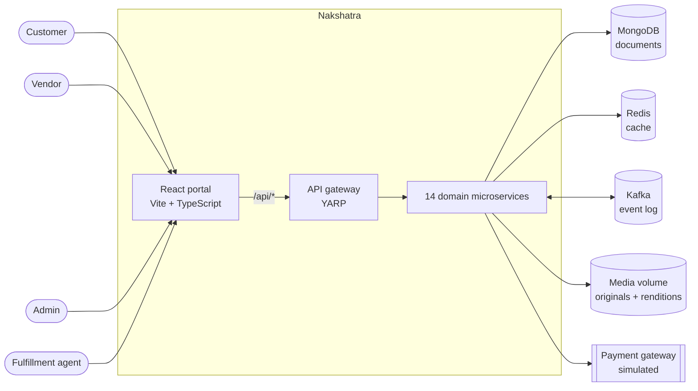
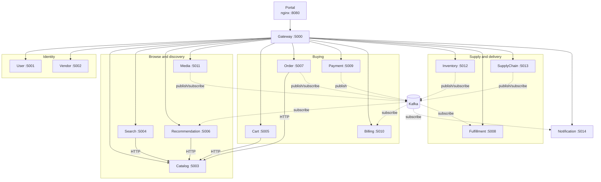
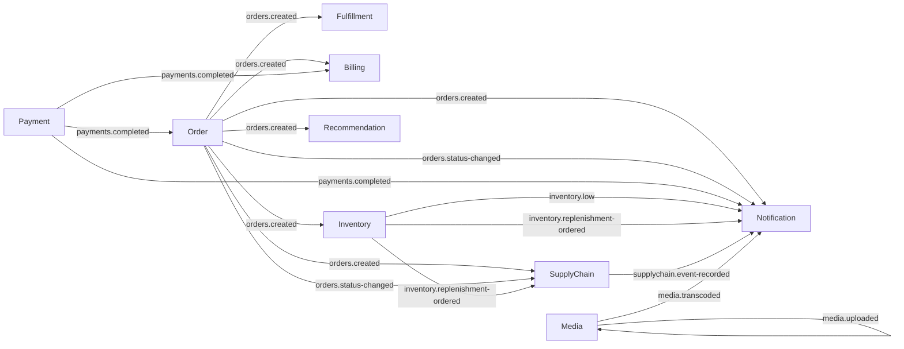
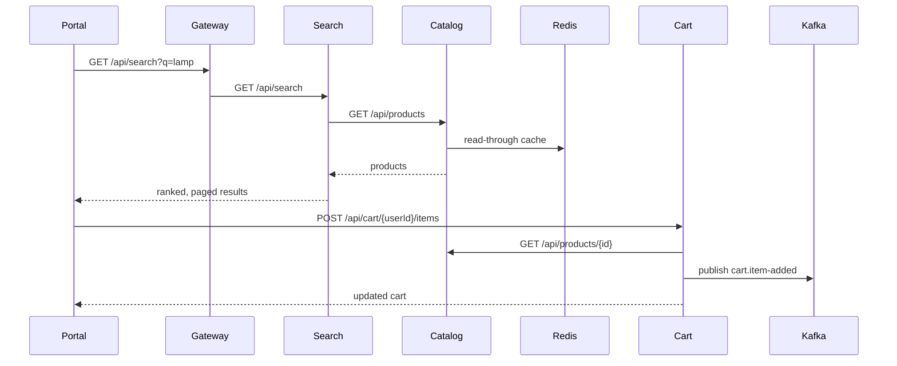
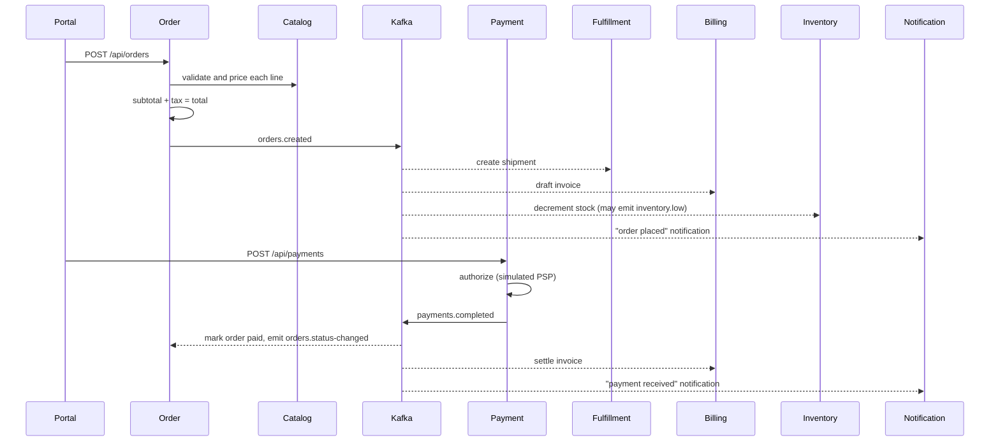
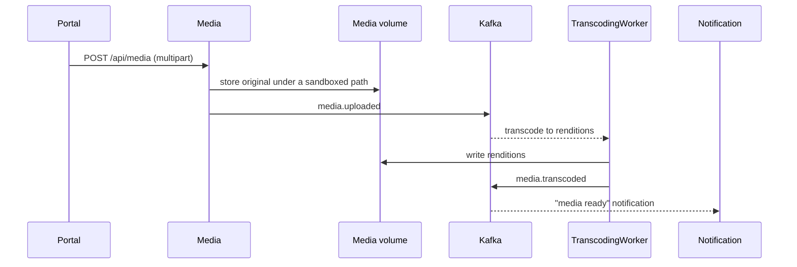
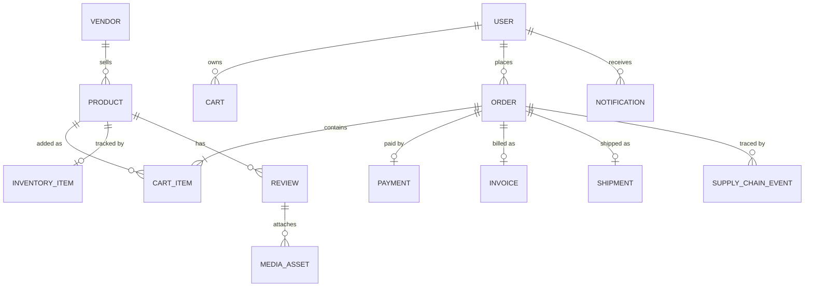
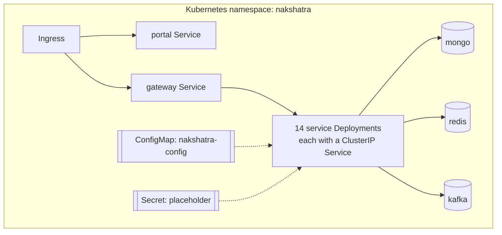

# Nakshatra — Architecture & System Design

Nakshatra is an online shopping platform built as a set of small .NET microservices behind a
single API gateway, with a React single-page portal as the only user-facing client. Services
communicate synchronously over HTTP for reads and asynchronously over Kafka for domain events.

- [1. Goals and constraints](#1-goals-and-constraints)
- [2. System context](#2-system-context)
- [3. Container / service map](#3-container--service-map)
- [4. Service catalog](#4-service-catalog)
- [5. Event-driven design](#5-event-driven-design)
- [6. Key flows](#6-key-flows)
- [7. Data design](#7-data-design)
- [8. Cross-cutting concerns](#8-cross-cutting-concerns)
- [9. Deployment topology](#9-deployment-topology)
- [10. Design decisions and trade-offs](#10-design-decisions-and-trade-offs)

---

## 1. Goals and constraints

| Goal | How it is met |
|------|---------------|
| Independent deployability | Each service is its own ASP.NET Core minimal-API process, built into its own image from the shared `backend/Dockerfile`. |
| One entry point for the portal | `Nakshatra.Gateway` (YARP reverse proxy) exposes every `/api/*` route; the portal never calls a service directly. |
| Loose coupling on the write path | State changes are published as Kafka events; downstream services react without the producer knowing about them. |
| Runs anywhere, including a laptop | Mongo, Redis and Kafka are optional — when unconfigured, `ServiceDefaults` substitutes in-process implementations so every service still starts and serves traffic. |
| Horizontal scalability | Services are stateless; all state lives in MongoDB, Redis, Kafka or the media volume, so replicas can be added or removed freely. |

## 2. System context

The four personas (`Customer`, `Vendor`, `Admin`, `FulfillmentAgent`) are modelled in
`Nakshatra.Shared.Models.Persona` and drive the portal's navigation and route guards.

## 3. Container / service map

Ports shown are the local development ports (`launchSettings.json`, and the gateway's
`ReverseProxy` cluster addresses). In Docker Compose and Kubernetes every service listens on
`8080` and is addressed by DNS name.

## 4. Service catalog

| Service | Responsibility | Key endpoints | Publishes | Consumes |
|---------|----------------|---------------|-----------|----------|
| **Gateway** | Single ingress, CORS, `/api/*` routing to the owning service | `/health`, `/api/**` | — | — |
| **User** | Users and personas | `/api/users`, `/api/personas`, `/api/users/by-persona/{persona}` | — | — |
| **Vendor** | Vendor master data | `/api/vendors` | — | — |
| **Catalog** | Product master data, stock reservation, reviews | `/api/products`, `/api/products/{id}/reserve`, `/api/products/categories` | — | — |
| **Search** | Keyword search, filtering, paging and type-ahead over catalog data | `/api/search`, `/api/search/suggest` | — | — |
| **Cart** | Per-user cart lines | `/api/cart/{userId}` and item add/update/remove | `cart.item-added` | — |
| **Recommendation** | Co-purchase graph, "also purchased", basket recommendations | `/api/recommendations/also-purchased/{productId}`, `/api/recommendations/basket` | — | `orders.created` |
| **Order** | Order creation, pricing (subtotal + tax), status transitions, cancellation | `/api/orders`, `/api/orders/{id}/status`, `/api/orders/{id}/cancel` | `orders.created`, `orders.status-changed` | `payments.completed` |
| **Payment** | Authorization and refunds through a simulated payment gateway | `/api/payments`, `/api/payments/{id}/refund` | `payments.completed` | — |
| **Billing** | Invoices derived from orders and payments | `/api/billing/invoices` | — | `orders.created`, `payments.completed` |
| **Fulfillment** | Shipments and their stage transitions | `/api/fulfillment/shipments`, `.../advance` | — | `orders.created` |
| **Inventory** | Stock levels, adjustments, replenishment, demand forecasting, reorder suggestions | `/api/inventory`, `.../adjust`, `.../replenish`, `.../forecast`, `/api/inventory/reorder-suggestions` | `inventory.adjusted`, `inventory.low`, `inventory.replenishment-ordered` | `orders.created` |
| **SupplyChain** | End-to-end traceability of orders and replenishments | `/api/supplychain/traces`, `/api/supplychain/stages` | `supplychain.event-recorded` | `orders.created`, `orders.status-changed`, `inventory.replenishment-ordered` |
| **Media** | Uploads, sandboxed storage, background transcoding into renditions | `/api/media`, `/api/media/{id}/renditions/{rendition}` | `media.uploaded`, `media.transcoded` | `media.uploaded` |
| **Notification** | Per-user notification inbox fed by domain events | `/api/notifications`, `.../read`, `.../read-all` | — | `orders.created`, `orders.status-changed`, `payments.completed`, `supplychain.event-recorded`, `inventory.low`, `inventory.replenishment-ordered`, `media.transcoded` |

## 5. Event-driven design

Topic names are centralized in `Nakshatra.Shared.Messaging.Topics`. Every message is wrapped in an
`EventEnvelope(Topic, Key, Payload)` where the key is the aggregate id (order id, product id, …),
so Kafka partitioning preserves per-aggregate ordering.

Consumers derive from `EventConsumerBackgroundService`, which subscribes on startup and keeps
processing for the lifetime of the host. Each consumer uses its own consumer group, so adding a
new subscriber never affects existing ones. `inventory.adjusted` and `cart.item-added` are
published as integration points for future consumers and analytics; nothing subscribes to them
today.

## 6. Key flows

### 6.1 Browse and add to cart

### 6.2 Checkout: order → payment → fulfillment

### 6.3 Media upload and transcoding

## 7. Data design

- **MongoDB** is the system of record. Every service owns its own collections; no service reads
  another service's collection — cross-service reads go through HTTP clients
  (`CatalogClient`, `OrderClient`, `RecommendationClient`) or through events.
- **Redis** is a read-through cache in front of hot document reads
  (`MapCachedCrud<T>` in `Nakshatra.Shared.Endpoints`), with explicit invalidation on write.
- **Kafka** is the durable event log and the integration backbone.
- **A filesystem volume** holds media originals and renditions; `MediaStorage` resolves paths and
  rejects anything that escapes the configured root (path-traversal protection).
- Shared domain models live in `Nakshatra.Shared.Models.Domain`, so producers and consumers agree
  on the wire shape of events.

## 8. Cross-cutting concerns

These are applied uniformly through `ServiceDefaults.AddNakshatraInfrastructure` and
`UseNakshatraDefaults`:

| Concern | Implementation |
|---------|----------------|
| Configuration | `appsettings.json` plus environment variables (`Mongo__…`, `Redis__…`, `Kafka__…`) |
| Graceful degradation | Missing Mongo/Redis/Kafka configuration falls back to in-memory repository, cache and event bus |
| Health | `/health` on every service, used by Compose healthchecks and Kubernetes probes |
| Rate limiting | Fixed-window limiter per client IP, per replica (`RateLimit:PermitsPerMinute`, default 600, rejecting with HTTP 429) |
| CORS | A single `nakshatra-portal` policy driven by `Cors:AllowedOrigins` |
| Serialization | Web-style camelCase JSON with string enum converters |
| Compression | Response compression enabled by default |
| Portal hardening | nginx sets `X-Content-Type-Options`, `X-Frame-Options` and `Referrer-Policy`; hashed assets are cached immutably |

## 9. Deployment topology

- **Local**: `docker compose up --build` starts Mongo, Redis, Kafka, all services and the portal.
  The gateway is published on `localhost:5000` and the portal on `localhost:8080`.
- **Kubernetes**: manifests live in `infra/k8s/` — namespace, ConfigMap and Secret in
  `00-namespace-and-config.yaml`, one manifest per service, portal and ingress in
  `90-portal-and-ingress.yaml`. Discovery is DNS-based, and every routing/backing-store address
  comes from the ConfigMap so images stay environment-agnostic.
- **Images**: one parameterized `backend/Dockerfile` (`SERVICE` and `INSTALL_FFMPEG` build args)
  for every .NET service; `frontend.Dockerfile` builds the portal and serves it from nginx.

## 10. Design decisions and trade-offs

| Decision | Rationale | Trade-off |
|----------|-----------|-----------|
| Gateway owns all `/api/*` routing | The portal has one origin and one CORS policy, and services can move without client changes | The gateway is a shared dependency that must be scaled and monitored carefully |
| Events for write-side integration | Order placement does not block on fulfillment, billing, inventory or notifications | Downstream state is eventually consistent |
| HTTP for cross-service reads | Simple, and avoids duplicating product data into search, cart and order | The read path depends on Catalog availability, mitigated by Redis caching |
| Database per service, no shared collections | Preserves service autonomy and independent schema evolution | Cross-domain queries must be composed by the caller |
| In-memory fallbacks for Mongo/Redis/Kafka | Fast local development and cheap integration tests without infrastructure | Fallback behaviour is single-process only and must never be used in production |
| Minimal APIs plus a shared `ServiceDefaults` | Little boilerplate and consistent cross-cutting behaviour across 15 processes | The shared library is a coupling point that must stay thin and stable |
| Filesystem media storage with sandboxed paths | Keeps the stack runnable anywhere | Object storage would be required for multi-replica production media |
